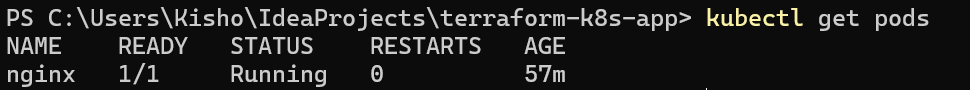
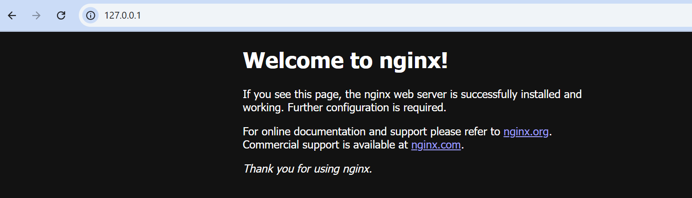

# terraform-k8s-app

Kubernetes Application with Terraform on Docker Desktop

This project demonstrates how to automate the deployment of a Kubernetes application using Terraform on a local Docker Desktop Kubernetes cluster. The application is a simple Nginx web server deployed with the following Kubernetes resources:

Deployment: To manage the application replicas.
Service: To expose the application using a LoadBalancer (or NodePort for local testing).
Namespace: To organize resources within the cluster.

Features
Infrastructure as Code: Using Terraform to automate the Kubernetes deployment.
Modular Design: Easy to modify and extend for different applications.
Local Testing: Designed to work seamlessly with Docker Desktop's built-in Kubernetes cluster.

Directory Structure

terraform-k8s-app/
│   main.tf          # Main Terraform configuration file
│   variables.tf     # Input variables for customization
│   outputs.tf       # Output values for easy access
│   provider.tf      # Kubernetes provider configuration
└── manifests/
    │   deployment.yaml  # Kubernetes Deployment manifest
    │   service.yaml     # Kubernetes Service manifest

Prerequisites
Ensure the following tools are installed on your system:

Docker Desktop (with Kubernetes enabled)
Terraform (v1.0+ recommended)
kubectl (configured to use Docker Desktop's Kubernetes)

Installation and Setup
Clone the Repository

git clone https://github.com/kishorepalem20/terraform-k8s-app.git
cd terraform-k8s-app

Initialize Terraform

terraform init

Review and Apply the Terraform Plan

terraform plan
terraform apply -auto-approve

This will:

Create a dedicated namespace (demo-namespace)
Deploy the Nginx application
Expose the application using a Kubernetes Service

Accessing the Application
After successful deployment, you can access the application using the exposed service.

Using Port Forwarding:
kubectl port-forward svc/nginx-app-service 8080:80 -n demo-namespace

Open your browser and navigate to:

http://localhost:8080

Using LoadBalancer:
If using LoadBalancer and Docker Desktop supports it, get the external IP:

kubectl get svc -n demo-namespace

Navigate to the external IP displayed.

Customizing the Application
You can customize the application by modifying the following variables in variables.tf:

app_name: Name of the application (default: nginx-app)
app_image: Docker image for the application (default: nginx:latest)
app_port: Port to expose the application (default: 80)
replicas: Number of replicas for the deployment (default: 2)
For example, to deploy a custom image with 3 replicas:

variable "app_image" {
  description = "Docker image for the application"
  default     = "your-custom-image:latest"
}

variable "replicas" {
  description = "Number of replicas for the deployment"
  default     = 3
}

Destroying the Deployment
To destroy all resources created by Terraform:

terraform destroy -auto-approve

Next Steps and Enhancements
Integrate with CI/CD tools like GitHub Actions or Jenkins.
Deploy additional Kubernetes resources (e.g., ConfigMaps, Secrets, Ingress).
Experiment with other containerized applications or microservices.
Deploy the application on cloud-managed Kubernetes (e.g., EKS, GKE, AKS).

Contributing
Contributions are welcome! Please fork the repository and create a pull request with your changes.

Contact
For any questions or suggestions, feel free to open an issue or contact me at:

GitHub: kishorepalem20
Email: kishorepalem20@example.com

